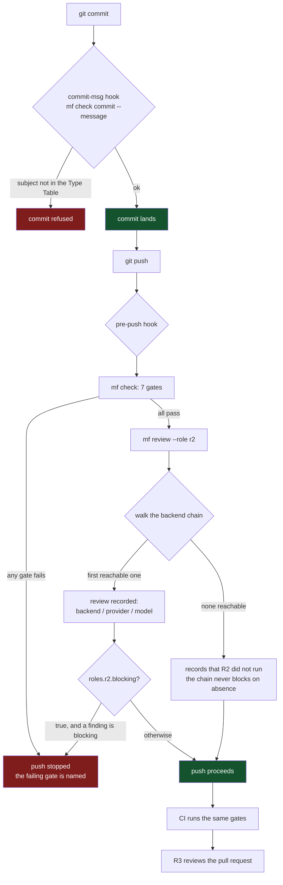

# my-framework: development standards that activate, not just document


[](https://github.com/LukeSantossz/my-framework/actions/workflows/ci.yml)
[](LICENSE)

Written standards are easy. Standards an AI coding agent actually reads, follows, and is checked against are not. This closes that gap.

## What It Does

- **Spec before code.** A spec under `docs/specs/` passes the Spec Gate before implementation starts.
- **Three review roles.** R1 internal, R2 cross-provider, R3 on the pull request. Each is a chain of backends chosen in configuration, bound to no vendor. A chain that falls back says which backend actually reviewed.
- **Seven deterministic gates in one command.** No model is called. Judging an artifact and judging a process are different tasks, and only the first is reliable.
- **The gates run where they can stop something:** in CI, in a pre-push hook, and in a commit-msg hook that reads the message still under the author's cursor. All three fail closed. A gate that cannot find its runner says so and stops instead of exiting zero in silence.
- **Reviewer provenance per branch,** so R2's cross-provider claim resolves to `verified`, `declared` or `unknown` rather than being assumed.
- One status line across agents, a CRUX change explainer, a terse prompt style with an enforced boundary, and a visual identity with a gate. Every standard here has something that performs it.
- PR and Issue templates plus triage labels, ready to adopt as-is.

## What It Is

A single Go binary, `mf`, plus versioned Markdown standards under `docs/standards/`. The binary reads the standards, runs the review roles, and deterministically enforces everything enforceable without a model.

The standards tree stays runtime-free. An adopter consuming it as a submodule needs no binary at all; the two artifacts are deliberately separate.

## Tech Stack

| Layer | Technology |
|---|---|
| Language | Go 1.26, one dependency |
| Standards | Markdown, read by the binary and by the agent |
| Configuration | TOML, split into a committed project layer and a machine layer |
| Testing/CI | `go test` and `mf check`, on GitHub Actions across Linux, macOS and Windows |

## Architecture

How it behaves once adopted:



The seven gates are `spec`, `commit`, `branch`, `docs`, `records`, `agents` and `design`. None calls a model.

## Engineering Decisions

| Decision | ADR |
|---|---|
| Decision records flow: SPEC to ADR to README | [`0001`](docs/adr/0001-decision-records-flow.md) |
| Specs become durable under `docs/specs/`; ADRs stay the curated rationale home | [`0002`](docs/adr/0002-durable-spec-archive.md) |
| CRUX review explainers are transient; ADRs stay the durable record | [`0003`](docs/adr/0003-crux-explainers-are-transient.md) |
| The R2 reviewer default is `gpt-5.6-terra`, chosen on benchmark | [`0004`](docs/adr/0004-r2-reviewer-model-gpt-5-6-terra.md) |
| Go is the substrate; the harness ships as a single binary | [`0005`](docs/adr/0005-go-substrate-single-binary.md) |
| Configuration is TOML, split by policy and machine state | [`0006`](docs/adr/0006-configuration-split-policy-and-machine.md) |
| Author provenance is a property of the change, not of the push | [`0007`](docs/adr/0007-author-provenance-belongs-to-the-change.md) |
| CRURA becomes triggered review, shipped instrumented | [`0008`](docs/adr/0008-crura-becomes-triggered-review.md) |
| Deterministic checks derive their vocabularies from the standards | [`0009`](docs/adr/0009-checks-derive-vocabularies-from-standards.md) |
| R1's provider constraint is per-backend, not a layer requirement | [`0010`](docs/adr/0010-r1-provider-constraint-is-per-backend.md) |
| A derived visual identity is verified by fingerprint, not asserted | [`0011`](docs/adr/0011-a-derived-visual-identity-is-verified-not-asserted.md) |
| The deterministic gates are enforced by CI and by fail-closed hooks | [`0012`](docs/adr/0012-gates-are-enforced-by-ci-and-fail-closed-hooks.md) |

## Getting Started

### Install

Prefer the released binary. It is stamped with its tag and verified by checksum, and needs no Go toolchain.

```sh
gh release download v0.7.2 --repo LukeSantossz/my-framework \
  --pattern 'mf_v0.7.2_linux_amd64' --pattern 'SHA256SUMS'
sha256sum --ignore-missing -c SHA256SUMS   # macOS: shasum -a 256 --ignore-missing -c
install -m 0755 mf_v0.7.2_linux_amd64 ~/.local/bin/mf
```

Assets exist for `linux/{amd64,arm64}`, `darwin/{amd64,arm64}` and `windows/amd64`. Without `gh`, they are at the [release page](https://github.com/LukeSantossz/my-framework/releases/tag/v0.7.2). `go install github.com/LukeSantossz/my-framework/cmd/mf@latest` also works and reports a true version, but builds from source and gives you no checksum.

### Adopt

```sh
cd /path/to/your/repository
mf init
```

It writes, and never overwrites anything already there:

| What | Where |
|---|---|
| The committed policy file | `.framework.toml` |
| 13 standards | `docs/standards/` (or wherever `paths.standards` points) |
| 4 agent source documents | `docs/agents/` |
| 2 versioned git hooks | `.githooks/` |
| The hooks wiring | `core.hooksPath = .githooks` |
| The adopted version | `.framework.lock` |
| The vendor instruction files | `CLAUDE.md`, `AGENTS.md` |

Nothing here picks a reviewer for you. To name one at adoption time:

```sh
mf init --provider <name> --endpoint <url> --api-key-env <VAR> --model <id>
```

`<VAR>` is the *name* of the environment variable holding the key, never the key. The loader refuses a credential in either file. Without these flags `init` writes no machine state at all.

It refuses rather than guesses in two cases: outside a git repository, and when this repository declares a submodule that is not checked out — nothing can then tell whether that submodule is what supplies the standards, and writing a second corpus is the one thing a re-run cannot undo. `mf init --standards <dir>` names the directory outright and skips the question.

Two more cases it declines rather than refuses, reporting each and carrying on: a standards path inside a submodule, which that submodule supplies, and a `core.hooksPath` another tool set, which is theirs to remove.

### Three things `mf init` does not do

1. **Put `mf` where the hooks can find it.** Both hooks fail closed, so the next `git commit` is refused until `mf` is on `PATH`, or a binary named `mf`/`mf.exe` sits at the repository root, or `MF_BIN` points at one.
2. **Set the base branch, if yours is not `main`.** On a `master` repository `mf check` stops with `ref "main" does not resolve`. Fix it once: `mf config set review.base master --project`.
3. **Write `CONTEXT.md`.** The domain glossary at your repository root is what `docs/agents/domain.md` tells every agent to read before exploring your code. No shipped file can guess your domain, and nothing gates it, which is exactly why it gets skipped.

### Then

```sh
mf author declare --provider <name> --model <id>   # once per branch
mf doctor                                          # what resolves, what is missing
mf check                                           # the gates, without waiting for a push
```

### Consuming the standards as a submodule

Point the paths at the submodule and every gate follows:

```toml
[paths]
standards     = ".standards/docs/standards"
specs         = "docs/specs"
adr           = "docs/adr"
agents_source = ".standards/docs/agents/instructions.md"

[agents.claude]
file        = "CLAUDE.md"
roles       = ["shared", "author"]
path_prefix = ".standards/docs/standards"
```

`path_prefix` is what rewrites the references inside the generated text. Without it the generated `CLAUDE.md` points at `docs/standards/...`, which does not resolve in this layout.

`mf init` writes that block for you when the submodule is checked out: it reads the corpus that is there rather than the default, so nothing is materialised beside it. Run `git submodule update --init` first — on an uninitialised submodule init refuses, because an empty directory is not evidence of anything.

There is no sync command, because the submodule *is* the corpus. Update it with `git submodule update --remote`, then `mf agents sync` regenerates the vendor instruction files.

### Your own instructions in the generated files

Everything above is the framework's text. What your repository must tell an agent — the toolchain pin, the isolate the work runs in, the decision a result surface may not offer retry until — no shipped document can guess, and editing the generated file is what the gate reports as drift. Declare a second, repository-owned source instead:

```toml
[paths]
agents_overlay = "docs/agents/project.md"
```

Mark it up with the same `<!-- mf:role author -->` markers. Each vendor file receives the framework's sections for the roles it plays, then yours, in that order. Your sections are never path-rewritten: they are your text about your layout, so they already resolve. A configured overlay that cannot be read fails `mf agents sync` and `mf check agents` rather than being skipped.

## API Reference

### Activation and diagnosis

| Command | What it does |
|---|---|
| `mf init [--standards <dir>] [--provider <name> --endpoint <url> --api-key-env <VAR> [--model <id>] [--kind <shape>]]` | Adopt this repository. Overwrites nothing. A checked-out submodule carrying a corpus is adopted as the layout, so no second one is written; `--standards` names the directory instead. The provider flags record your chosen reviewer in the machine layer and name it in the R2 chain. |
| `mf doctor` | Build, activation state, every role's chain and each backend's reachability, cross-provider state, credentials, usage, which Token Economy clauses are implemented, and whether the standards match this build. Changes nothing. |
| `mf hooks install\|uninstall\|status` | Wire, unwire or report `core.hooksPath`. Install refuses a path it does not own; uninstall removes only what `mf` set and is idempotent. |
| `mf upgrade` | Compare your standards against the ones this build carries. Applies nothing: your standards are your content. |

### Gates

| Command | What it does |
|---|---|
| `mf check` | All seven gates. |
| `mf check <gate>...` | Only the named gates. |
| `mf check commit --message <file>` | Check one message file rather than the branch's commits. What the `commit-msg` hook runs. |

### Review

| Command | What it does |
|---|---|
| `mf review --role <r1\|r2\|r3>` | Walk the role's chain, take the first available backend, report which one reviewed. |
| `mf review ... --base <ref> \| --dry-run` | Review against another base, or print the chain and what would be sent without calling anything. |
| `mf review --role r3 --pr <n> --post` | Post the R3 result as a pull request comment. |
| `mf author declare --provider <name> [--model <id>]` | Record the Author for this branch. It is the claim R2 is checked against. |
| `mf eval [--role <role>] [--backend <name>]` | Measure a backend against `docs/eval/corpus/`. Reaches real providers. |
| `mf explain [--base <ref>] [--difficulty easy\|medium\|hard] [--dir <path>] [--dry-run]` | Generate the CRUX explainer outside version control. Advisory. |

### Configuration

| Command | What it does |
|---|---|
| `mf config get <key>` | One resolved value and the layer it came from. |
| `mf config list [--provenance]` | Every resolved value, optionally with its source. |
| `mf config set <key> <value> [--machine\|--project]` | Write one value into the layer that owns it. |
| `mf config validate` | Report every problem, including a route it names and cannot reach. |
| `mf config migrate` | Take over the deprecated `r2.*` git-config keys. |
| `mf models pin\|list` | Record the model each backend resolves to, or report drift against the pins. |
| `mf usage [show\|reset]` | Runs and tokens spent, in disjoint buckets. |
| `mf agents sync\|check` | Regenerate the vendor instruction files from one source, or report drift. |
| `mf statusline render [--no-refresh]\|apply\|refresh\|revert` | The status line contract. `apply` edits the agent's own configuration; `revert` puts back what it replaced. `--no-refresh` (or `MF_STATUSLINE_NO_REFRESH`; the older `MYFW_`-prefixed name is still read) draws from the cache without spawning the quota fetch. |

### Keys

| Key | Default | Meaning |
|---|---|---|
| `paths.standards` | `docs/standards` | Where every gate reads the standards. |
| `paths.specs` / `paths.adr` | `docs/specs` / `docs/adr` | The durable archives the Spec and records gates read. |
| `paths.agents_file` | `AGENTS.md` | The instruction file a repository-reading backend finds on disk. |
| `paths.agents_source` | `docs/agents/instructions.md` | The single source the vendor files are generated from. |
| `paths.agents_overlay` | *(none)* | This repository's own instruction sections, appended to the generated files. Same role markers; never path-rewritten. |
| `review.base` | `main` | The ref a change is compared against. |
| `review.effort` | `high` | Reasoning effort passed to a backend that takes one. |
| `review.max_diff_bytes` | `30000` | The diff budget a backend is handed. |
| `review.timeout_seconds` | `240` | Wall-clock budget. Exceeding it counts as unavailability. |
| `roles.<role>.backends` | `codex` for `r2`, empty otherwise | The ordered chain. An empty list declared in the project file overrides a lower layer. |
| `roles.<role>.blocking` | `false` | Whether a finding classed blocking stops the pre-push hook. |
| `roles.<role>.require_cross_provider` | `true` for `r2` | Whether the Reviewer's provider must differ from the Author's. |
| `backends.<name>.*` | | `kind`, `provider`, `command`, `args`, `model`, `effort`, `structured`, `unavailable_patterns`. |
| `providers.<name>.*` | | `kind`, `endpoint`, `api_key_env`. Machine layer only. |

The cascade runs defaults, legacy git-config, machine, project, environment. Each layer outranks the one before it. Every key above is overridable for one run as `MF_<KEY>`, uppercased with dots as underscores — the form reaches a key the cascade resolved, so a `backends.<name>.*` variable naming a backend nothing declares is ignored rather than defining one.

## Project Structure

```text
my-framework/
├── cmd/mf/               # the binary's entry point
├── internal/             # config, roles, backends, checks, report
├── docs/
│   ├── standards/        # binding standards, read via INDEX.md
│   ├── adr/              # durable decision records
│   ├── specs/            # durable archive of approved specs
│   ├── agents/           # the source the vendor instruction files come from
│   └── eval/corpus/      # diffs with planted defects, for measuring a backend
├── .framework.toml       # committed policy: paths, roles, backends, checks
├── .githooks/            # commit-msg and pre-push, both failing closed
└── .github/              # templates, and the CI, gate, release and review workflows
```

## Project Status

In development. `v0.7.2` is the current release. `v0.7.1` was the first whose records gate can tell a durable number another branch is holding from one a deleted record left behind, so a repository with two changes open at once can push. `v0.7.0` was the first in which a repository that vendors these standards can state its own obligations in the generated instruction files rather than choosing between deleting them and failing the gate. `v0.6.2` was the first whose `mf init` leaves a Windows-adopted repository with hooks a clone will actually run. `v0.6.0` was the first tag whose `mf init` adopts a repository that vendors these standards as a submodule rather than writing a second corpus beside it. It publishes stamped binaries for five platforms with a `SHA256SUMS` covering all of them. `v0.5.0` was the first tag whose `mf init` genuinely adopted a repository at all; `v0.4.0` was the first to contain `cmd/mf/`; `v0.1.0` through `v0.3.0` are the earlier standards-only releases. Versioning is semver git tags, and `mf init` records the adopted tag in `.framework.lock`.

Done: the seven gates and the three places they run, the four role chains, the configuration cascade, the status line contract, the CRUX explainer, the eval corpus, the design gate, and an `mf init` that genuinely adopts a repository.

Pending: the fingerprint table that would let R2 report `verified`; a first R1 backend that is not `in-session`; a workflow-hosted R3 beside the forge app that reviews here today; removal of the Node status line renderer once the submodule consumers have migrated; an `mf eval` that can compare two recorded runs, which `eval.Comparable` is written for and nothing calls.

## Known Issues & Limitations

**Review layers**

- **R1 runs only from inside a session.** Its shipped chain is `superpowers`, an `in-session` backend nothing can start as a subprocess. It is satisfiable: the session that reviewed records `git config --local mf.attestation.r1 $(git rev-parse HEAD)`. But nothing outside a session can produce that record, so CI and a plain terminal report R1 as not run.
- **R3 runs here as a forge app, not from the workflow.** `.framework.toml` declares CodeRabbit, which reviews every pull request and does find things. The workflow-hosted alternative needs `MF_R3_ENDPOINT` and friends, unset here. That is an addition rather than a gap. A fork's pull request cannot run it at all, by GitHub's design.
- **R2 needs at least one reachable backend.** When none is, R2 does not run for that push, the runner says so, and CRURA human review substitutes.
- **The cross-provider requirement compares two labels.** Both provider names are configuration strings nothing verifies against the endpoint actually reached. The claim is exactly as strong as the labels, which is why the state is recorded beside the review rather than reduced to a pass. Raised in issue #16, which closed as superseded; the surviving question is recorded in `docs/specs/0027` and is still open.
- **The fingerprint table that would let R2 report `verified` ships empty.** Guessing which environment variables a vendor's agent sets would be inventing them, which `ai_guidelines.md` forbids.

**Backends**

- **Every `cli` backend classifies quota, authentication and network failures by matching its tool's error text,** which drifts when a vendor rewords it. A drifted pattern reads an unavailable backend as one that reviewed, so the chain stops and names it rather than falling through silently.
- **`gemini` is exercised against a stub, not the real CLI,** which is not installed here. Its dispatch and contract are pinned; its real invocation is unverified, which is why the prompt argument is configurable.
- **A `cli` backend's answer is prose unless it declares `structured = true`,** and only a structured finding carries a severity that can block or a category `mf eval` can score.
- **A reasoning model behind an `api` backend has volatile latency,** so the 240s budget is reachable rather than guaranteed. Measured against `deepseek-v4-flash`: 8 KB of diff took 27s, 30 KB took 85s, 40 KB took 163s once and exceeded the budget the next time, and 112 KB never returned. Exceeding it counts as unavailability, so the push is never held hostage to a slow reviewer.
- **A local model is a much weaker reviewer than a hosted frontier one.** The reported backend line is what keeps a fallback from passing as an equivalent review.
- **The deprecated `r2.openai.model` git-config key is not migrated,** because a per-backend model now lives on the backend it belongs to.

**Adoption**

- **`mf init` adopts the harness, not the forge.** It does not write `.github/` templates or workflows, `CONTEXT.md`, or the `.gitattributes` that keeps a Windows checkout from failing the formatting gate. Those are still copied by hand.
- **The standards assume a single repository.** A multi-repo setup with conflicting standards would need an authority hierarchy this framework does not define.
- **Two commits reachable from `main` carry AI-attribution trailers,** against this repository's own rule. They are not rewritten: both are published, and force-pushing over shared history to fix a commit message costs more than the defect. Recurrence is guarded twice, by the `commit-msg` hook and by `mf check commit`. A commit pushed straight to `main` is outside both.

**Status line and explainer**

- **The status line contract is machine state,** because the Codex TUI section has no per-project scope. Applying it governs every project on the machine.
- **Two status line implementations coexist:** `mf statusline render` and the Node renderer under `scripts/statusline/`. The suite that held the Node one to the contract went with the shell path, so it is untested and can drift. It is retained only until the submodule consumer has migrated.
- **The Codex segment names were read out of an installed build, not a published schema.** A rename upstream would leave the written configuration silently ignored. The vocabulary as read is recorded in `docs/specs/0012`.
- **The Claude Code quota fact reads an undocumented OAuth endpoint** and needs an OAuth session. An API-key session shows `usage n/a`.
- **`mf explain` sends a diff to a model and gets prose back, and nothing checks that prose against the code.** It stays advisory and is read against the diff rather than instead of it.

**Gates**

- **The design gate reads colour literals with a regular expression, not a CSS parser.** It finds hex and `rgb()`, which are the forms this repository writes. `design.md` forbids the forms it cannot catch rather than the gate pretending to catch them.
- **The design fingerprint proves the source entry's literal colours and typefaces are not reused.** It cannot prove independence of design: direction is not a value.
- **The Token Economy's terse boundary is enforced only where the harness composes the prompt.** A hand-written commit message is outside it.
- **`mf eval` grades by matching findings against planted defects,** never by a model judging a model. The numbers are self-reported and measure this corpus and these prompts.
- **Executable bits are trusted from the git index, not the filesystem,** because Windows does not reliably report them. `mf init` stages the hooks it writes with the bit set for the same reason, and `mf doctor` names any the index records without it.

Small deferred follow-ups live in the issue backlog.

## Contributing

Fork, branch as `type/TASK-NNN-description`, write tests before implementation, and use Conventional Commits. Open a Pull Request following the PR Model in `docs/standards/github.md`.

## License

MIT, see [`LICENSE`](LICENSE).
